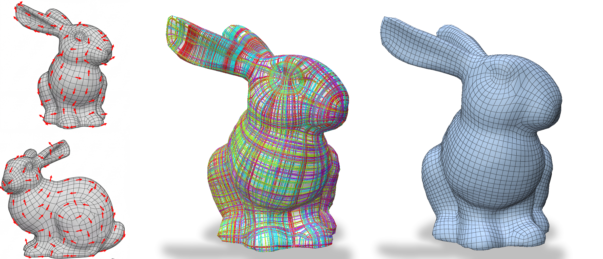
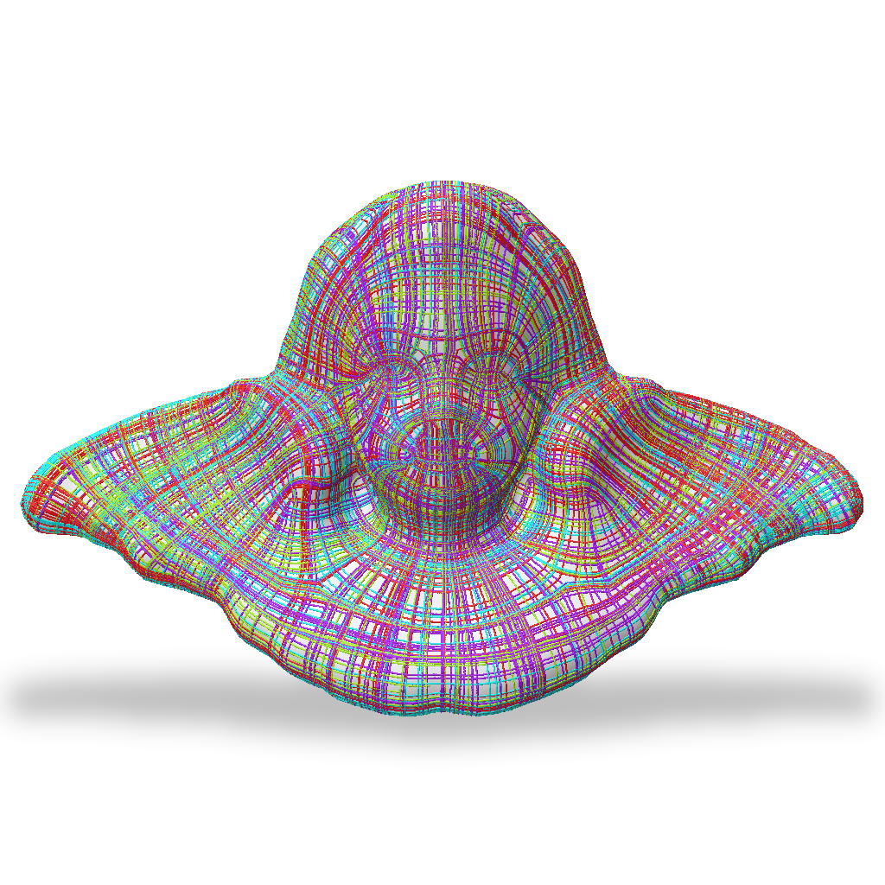
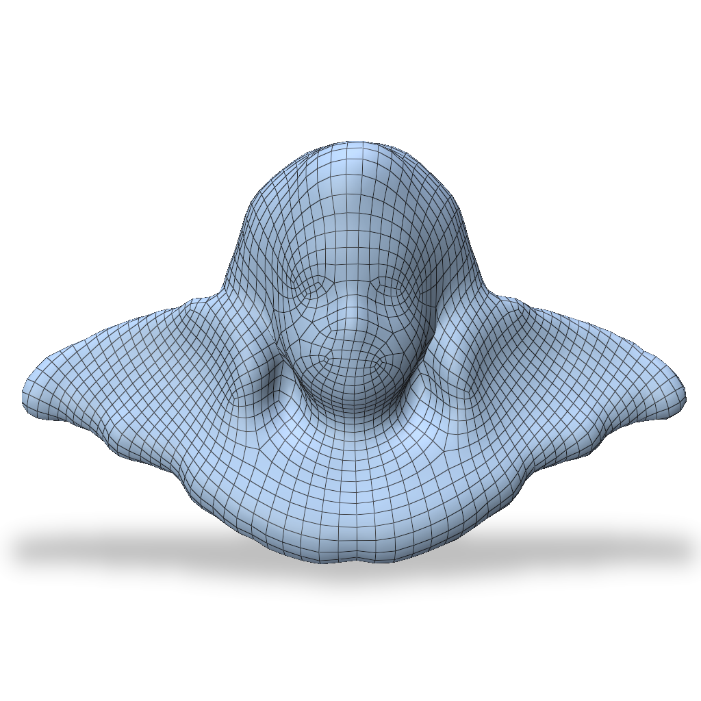
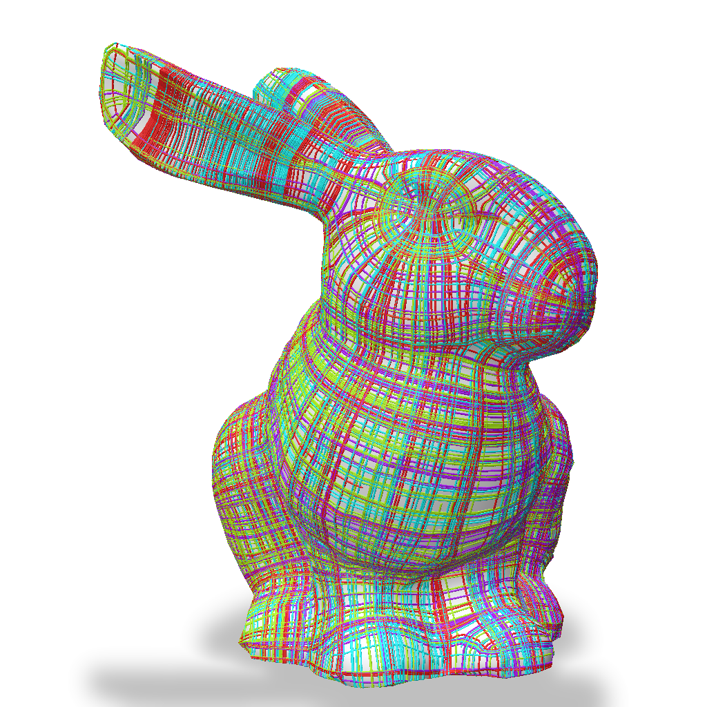
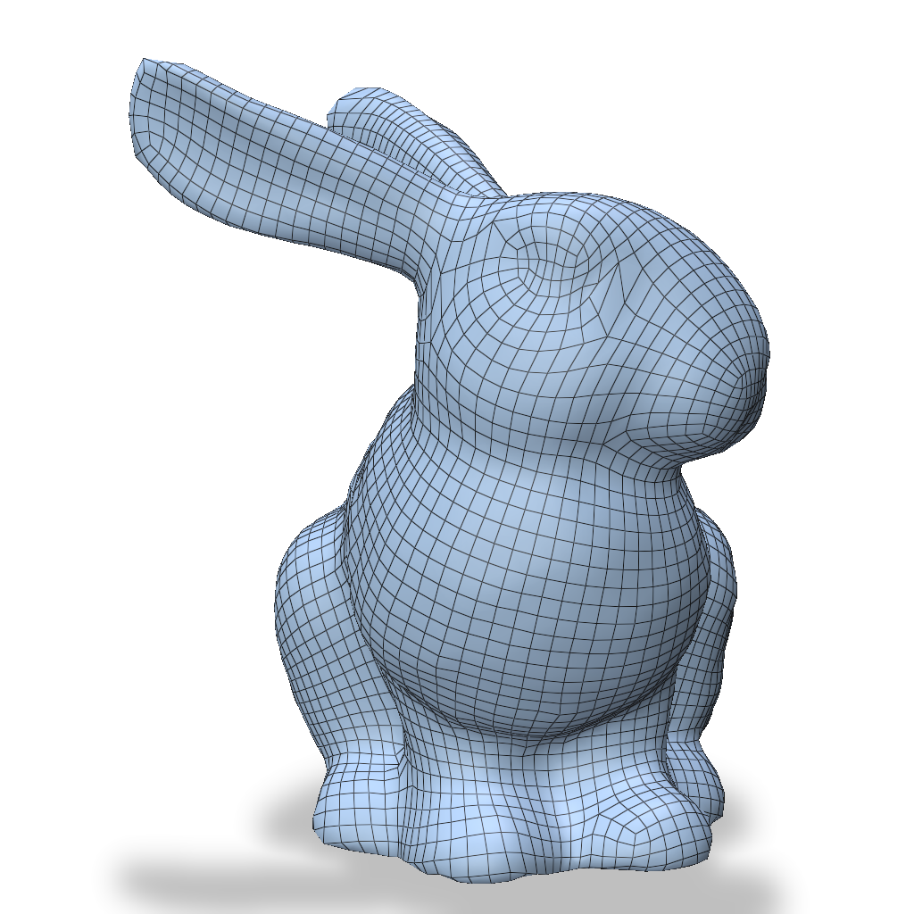
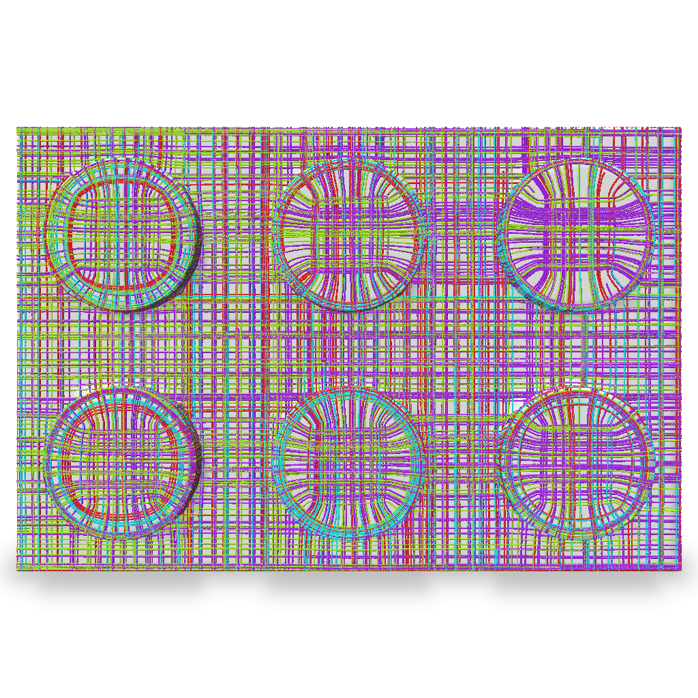
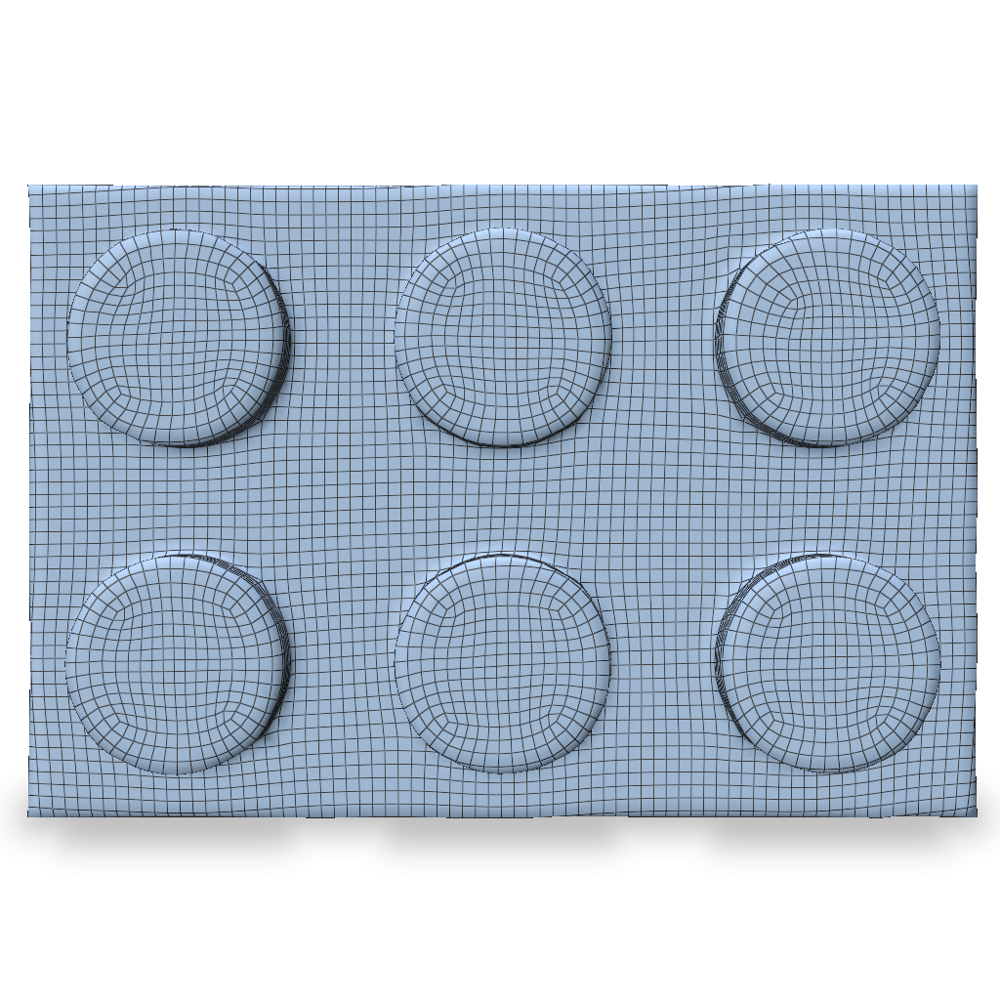

# CrossLift

*[Dale Decatur](https://ddecatur.github.io/), [Jacob Serfaty](https://www.jacobserfaty.com/), [Oded Stein](https://odedstein.com/), [Amir Vaxman](https://avaxman.github.io/), [Rana Hanocka](https://people.cs.uchicago.edu/~ranahanocka/)*

<a target="_blank" href="https://threedle.github.io/crosslift/"></a>
<a target="_blank" href="https://arxiv.org/abs/2605.26062"></a>



### Abstract
*We present CrossLift, a technique for computing cross fields on meshes guided by visual features in images. We leverage powerful text-to-image priors that are capable of synthesizing images of feature-aligned quad meshes in 2D. We extract this signal as explicit per-pixel directions in the 2D images, which we then back-project to the mesh surface. We aggregate these candidate surface directions by performing two smooth interpolations on the mesh surface (first within each view and second across multiple views). We propose custom confidence-based weights for the candidate directions in each interpolation that allow us to resolve conflicts between candidates on the same face and smoothly interpolate our field to occluded faces. Our method is modular and can be used with many different 2D visual priors. We show additional applications to texture-aligned quad meshing as well as interactive cross-field design using coarse, user-drawn lines as signal. We demonstrate the effectiveness of CrossLift on a diverse set of both organic and mechanical shapes and produce quad meshes that exhibit superior semantic alignment as compared to existing methods.*


## Getting Started
**Install uv** (if not already installed)
```bash
curl -LsSf https://astral.sh/uv/install.sh | sh
source ~/.bashrc
uv --version
```
**Clone the repository**
```bash
git clone git@github.com:threedle/crosslift.git
cd crosslift
```
**Sync the environment**
```bash
uv sync
```

**Setup 2D image model**

To use Flux or Gemini, install the necessary dependencies:
```bash
uv sync --extra flux --extra gemini
```
For flux, if you do not already have one, create a [Hugging Face account](https://huggingface.co/join).
Log in to Hugging face locally:
```bash
uvx hf auth login
```
and follow the prompts to login either via the browser or with an access token.

For Gemini, create an account, generate an api key and place the key `GOOGLE_API_KEY=<your-api-key>` in the file `.env`:
```
crosslift/
    ...
    src/
    .env
    ...
```

## Run the Code
Configuration options in `src/crosslift/config.py` can be overwritten either from a YAML config file or directly with command line arguments (or a combination of both where command line arguments take priority).

We provide several example config files to produce results from the paper below.
```bash
uv run crosslift --config_path configs/angel.yaml
uv run crosslift --config_path configs/bunny.yaml
uv run crosslift --config_path configs/lego.yaml
```

<p align="left">
  
  
  
  
  
  
</p>

Alternatively, you may use your own meshes with your own desired settings (see example commands shown below).
```bash
uv run crosslift --path data/angel.obj --run_name outputs/angel_flux --guidance.method flux --solve.lambda_s 1.0
uv run crosslift --config_path path/to/config.yaml
uv run crosslift --config_path path/to/config.yaml --guidance.method flux
```

When running this method on low quality meshes or less clean image guidance (i.e. Flux), we recommend using a stronger smoothness weight and performing curl correction (to improve integrability) before quad extraction. We detail these settings in `configs/robust_config.yaml` and use these settings for our quantitative evaluation in the paper (optional commented out settings are not used). However, these more conservative settings can at times smooth details present in the image guidance, so by default we leave them off and allow users to choose their desired parameters. Additionally, for some pathological meshes, the integration step for quad extraction can take a long time so we offer an optional alternative below (see `QuadWild quad-extraction backend`).

**Optional: QuadWild quad-extraction backend**

For certain pathological meshes, the integration step with MIQ can take a long time so we provide an optional fallback where users can extract a quad mesh from our cross field using QuadWild's backend instead of MIQ integration. To use the optional `quad.method=quadwild` quad-extraction backend, first built it with the following script:
```bash
./scripts/install_quadwild.sh
```
This can take several minutes and needs `cmake`, `git`, a C++20 compiler (GCC >= 10) and BLAS/LAPACK
(`liblapack-dev`, `libopenblas-dev` on Debian/Ubuntu). Then set `quad.method=quadwild` instead of `miq` to use the QuadWild backend.

## Acknowledgements
This project is built on top of [Mixed-Integer Quadrangulation](https://www.graphics.rwth-aachen.de/publication/0344/), [Directional](https://avaxman.github.io/Directional/), [libQEx](https://github.com/hcebke/libQEx), and [QuadWild](https://github.com/nicopietroni/quadwild). We thank these authors for their amazing work.

## Citation
```bibtex
@article{decatur2026look,
  title   = {Look Both Ways Before You Cross: Lifting Cross Fields From 2D Visual Priors},
  author  = {Decatur, Dale and Serfaty, Jacob and Stein, Oded and Vaxman, Amir and Hanocka, Rana},
  journal = {arXiv preprint arXiv:2605.26062},
  year    = {2026}
}
```